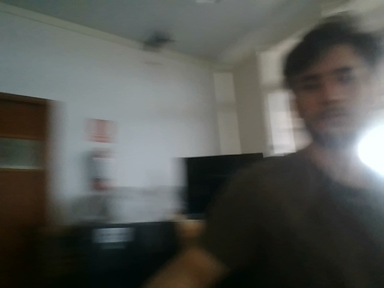

# Facial-landmark-detection-from-file-modificada

### Instalation

In order to use this code is necesary to install the modules in requirements.txt and run the installer.py program to download the models use.

Necesary instalation to run the code:
    `pip install requirements.txt`
    `python.exe installer.py`

### Face Detection

This detects faces and facial landmarks on an image, the image has to be located in local directory: input.

A python file to detect facial landmarks via webcam.(Dudas)
A jupyter notebook to detect image files located in directory.(Dudas)

This project uses Python 3.10, openCV 4.9.0.80, numpy 1.26.4 and scipy 1.13.0

The model used for landmark detection can be got from: 
https://github.com/kurnianggoro/GSOC2017/raw/master/data/lbfmodel.yaml

Also the model used for face detection can be found here:
https://raw.githubusercontent.com/opencv/opencv/master/data/haarcascades/haarcascade_frontalface_alt2.xml

## Landmark Detection on image

 Picture on phone placed in front of webcam

## Result Samples

#### Landmark Detection

### Credits

https://github.com/albertofernandezvillan
 https://github.com/kurnianggoro/GSOC2017
 https://github.com/sacchitchadha
 https://github.com/

# Procesamiento

### Instalation

This module use numpy, json, cv2 and an internal module elipse

### Functions

#### carga_marcadores(archivo, verbose)

This function takes the name of a file as archivo and a condicion as verbose. If verbose is True, it takes the markers from a json file, if verbose is False it takes the markers from a txt file.

#### extraer_x_e_y(a)

This function takes an array of the points and transform them in two array, one with the x coordeantes ans other with the y coordenates.

### Verbose

Verbose is a condition that make certain parts of the code work. 

If verbose is equal or greater than 1, the code executes the calculations and save the results in a json file.

If verbose is equal or greater than 2, the code also shows the image with some calculations shown.

If verbose is equal or greater than 3, the code also prints the calculated parameters in the command window

# Elipse

### Instalation

This module use math, random, numpy and scipy

### Functions

#### get_ellipse(center, major, ratio, rotation, n_points)

This algorithm takes as input the center, major axis, ratio (major axis/minor axis) and rotation of the ellipse, also the amount of points. It returns an array with points of the ellipse, the array has a length equal to the amount of points.

#### get_random_ellipse(center, n_points)

This algorithm takes the center of the ellipse and the amount of points. It randomize the major axis, ratio and rotation. It use the function get_ellipse with the randomized parameters, obteining the points of the random ellipse. It returns an array with the points of the random ellipse.

#### get_best_ellipse(points)

This algorithm takes the points. It stimates the parameters of the ellipse and returns them in a dict.

#### fit_ellipse(x, y)

This algorithm takes two array, ones with the x coordenate of the points and other with the y coordenate. It use the Halir y Flusser algorithm "Numerically stable direct least squares fitting of ellipses" to estimate cartesian coefficients of the conic that best fits the points. It returns this coeficients in an array.

#### cart_to_pol(coeffs)

This algorithm takes an array with the cartesian coefficients of the conic and transform them into the parameters of the ellipse. It returns this parameters in a dict.

#### get_best_ellipse_alt(points)

This algorithm takes the points and use the functions fit_elipse and cart_to_pol to get the parameters of the elipse that best fit the points. This parameters are return in a dict.
