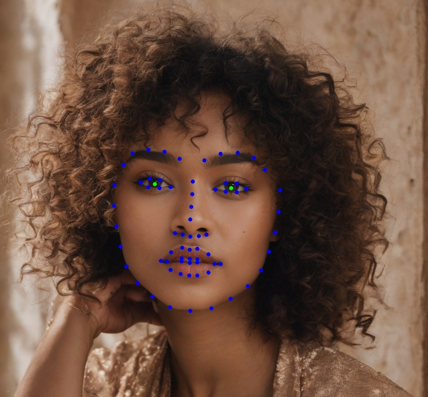
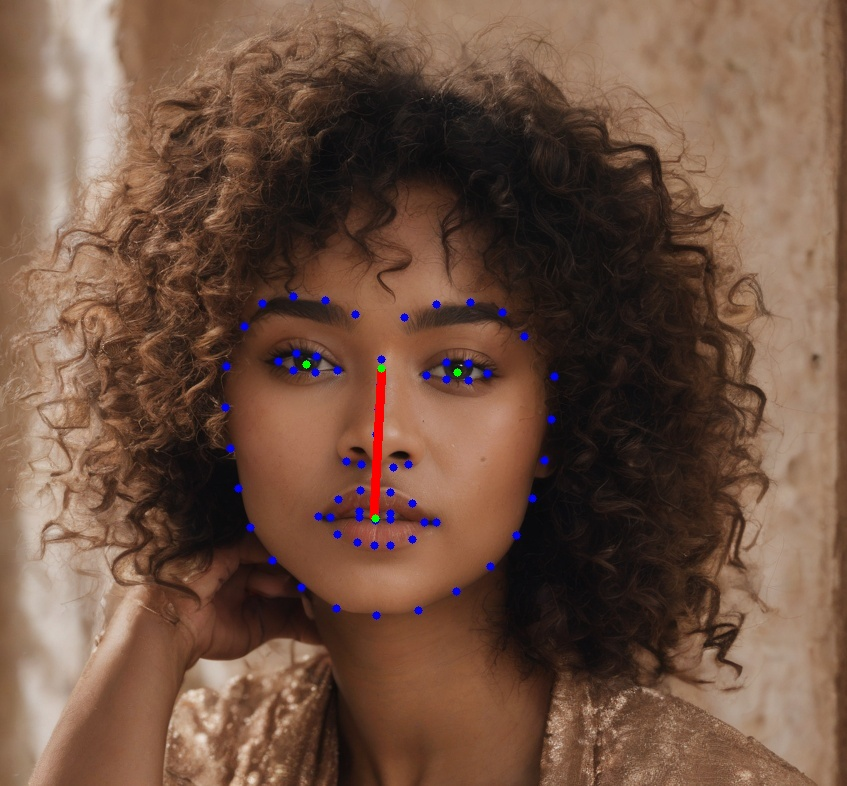

# Facial feature detection

This program use a facial landmark detection algorithm to detect faces and its landmarks on an image.

The landmakrs are use to calculate facial features.

## Instalation

In order to use this code is necesary to install the modules in requirements.txt and run the installer.py program to download the models use.

Necesary instalation to run the code:
    `pip install requirements.txt`
    `python.exe installer.py`

This project uses Python 3.10, openCV 4.9.0.80, numpy 1.26, scipy 1.13.0, json and math

The model used for face detection can be found here:
https://raw.githubusercontent.com/opencv/opencv/master/data/haarcascades/haarcascade_frontalface_alt2.xml

Also the model used for landmark detection can be got from: 
https://github.com/kurnianggoro/GSOC2017/raw/master/data/lbfmodel.yaml

The model used for aproximating point to a elipse can be got from:
https://github.com/cjgb/ellipses/blob/dev/mylib.py

## Ejemplos

## Credits
Landmark detection:
https://github.com/Danotsonof/facial-landmark-detection

Elipse:
https://github.com/cjgb/ellipses

